# 🛡️ CHARTERGUARD

> **Autonomous DAO Governance Mandate & Revision Sentry on GenLayer**  
> *Governed by Multi-Validator Comparative Consensus, Deterministic Calldata Diffing, and Author-Only Enactment Sentry.*

[](https://explorer-studio-next.genlayer.com/address/0x2647C6fb4337E422ad32e12A55D87A4DFe26a0D4)
[](https://explorer-studio-next.genlayer.com/address/0x2647C6fb4337E422ad32e12A55D87A4DFe26a0D4)
[](contracts/charter_guard.py)
[](tests/test_charter_guard.py)
[](frontend/)


---

## 🏛️ Executive Summary & The Governance Drift Problem

In decentralized governance, foundational charters, grant covenants, and treasury mandates frequently evolve through community revisions. However, the interval between proposal drafting and voting introduces an acute governance attack vector: **Mandate Drift & Deceptive Scope Creep**:

- **The Semantic Blindspot:** Traditional smart contracts (EVM) can verify arithmetic balances, but are fundamentally blind to natural language prose. They cannot discern whether an amended charter text subtly broadens executive discretion, relaxes milestone oversight, removes multi-sig co-signatures, or extends timeline commitments.
- **The Centralized Oracle Trap:** Delegating revision auditing to a centralized AI service or single foundation operator introduces censorship and single-point-of-failure vulnerabilities. A compromised operator can selectively rubber-stamp amendments that favor allied factions.
- **The Deceptive Changelog Attack:** A proposer modifies critical execution parameters (e.g. increasing budget caps or redirecting funds) while submitting a deceptive changelog summary claiming *"Minor formatting cleanup and grammar fixes."*

**CharterGuard** solves this by establishing a decentralized, multi-validator revision defense gate on GenLayer. It decouples machine parameter diffing from semantic disclosure analysis, guaranteeing that no governance amendment can become active canon unless its author transparently discloses every material alteration to the community.

---

## 🛡️ The Guardian Sentry Architecture

CharterGuard enforces a strict division of authority across four specialized layers:

```mermaid
flowchart TD
    subgraph S1["1. Mandate Establishment"]
        A["Author Seals Mandate"] --> B["Epoch 1: CANON_ACTIVE"]
        B --> C["Cryptographic Lineage Anchor<br/>SHA-256 Text & Manifest Digests"]
    end

    subgraph S2["2. Amendment Draft & Diff Engine"]
        D["Proposer Submits Amendment Draft"] --> E["Deterministic Manifest Diff Engine"]
        E --> F{"Machine Calldata Divergence?<br/>Target / Selector / Recipient / Value / Amount"}
        F -- Yes --> G["Tagged: Divergence Flags<br/>e.g. CAPITAL_DELTA, RECIPIENT_DIVERGENCE"]
        F -- No --> H["Tagged: CALLEDATA_UNCHANGED"]
    end

    subgraph S3["3. Guardian Council: Multi-Validator Semantic Consensus"]
        G --> I["gl.eq_principle.prompt_comparative"]
        H --> I
        I --> J["Validator 1: Independent Prompt Execution"]
        I --> K["Validator 2: Independent Prompt Execution"]
        I --> L["Validator N: Independent Prompt Execution"]
        J & K & L --> M{"Effect-Aligned Consensus<br/>Do changelog disclosures fully match<br/>all material semantic & executable shifts?"}
    end

    subgraph S4["4. Deterministic Override & Enactment Sentry"]
        M -- "Concealed Changes or Action Diff Mismatch" --> N["AUDIT_VETOED / BLOCKED"]
        M -- "Transparent Full Disclosure" --> O["AUDIT_CERTIFIED"]
        O --> P{"Only Original Author<br/>get_caller_address == charter.author"}
        P -- Authorized Author --> Q["enact_amendment"]
        P -- Outsider / Reviewer --> R["Revert: ONLY_CHARTER_AUTHOR"]
        Q --> S["Atomic Transition:<br/>Epoch 1: CANON_SUPERSEDED<br/>Epoch 2: CANON_ACTIVE"]
    end

    style S1 fill:#0f121b,stroke:#f59e0b,stroke-width:2px
    style S2 fill:#0f121b,stroke:#10b981,stroke-width:2px
    style S3 fill:#0f121b,stroke:#8b5cf6,stroke-width:2px
    style S4 fill:#0f121b,stroke:#ef4444,stroke-width:2px
```



---

## ⚔️ Stand-Out Technical Innovations

### 1. Deterministic Calldata Diffing vs. Non-Deterministic Semantic Consensus
Unlike naive LLM contracts that trust an AI to spot number and address differences in messy text, CharterGuard strictly normalizes and diffs calldata manifests in Python smart contract code (`compute_manifest_divergence`). If an address, selector, asset, or amount changes, the contract flags it deterministically. The GenLayer AI validators are tasked strictly with judging whether the human prose changelog completely explains those changes to voters.

### 2. Deterministic Action Diff Override Gate
Even if an LLM validator hallucinates or outputs `FULLY_DISCLOSED`, CharterGuard's on-chain smart contract code executes a hard override:
```python
has_action_diff = len(amendment["divergence_flags"]) > 0
diff_disclosed = "EXECUTABLE_ACTION_DELTA" in verdict.get("material_impacts", [])

is_disclosed = (
    verdict.get("decision") == "FULLY_DISCLOSED"
    and verdict.get("disclosure_complete") is True
    and (not has_action_diff or diff_disclosed)
)
```
If an action divergence exists on-chain and was omitted from the audit's disclosed impact list, the contract automatically overrides the result and **vetoes the amendment**.

### 3. Effect-Aligned Equivalence Principle
Naive equivalence prompts demand exact string matching over subjective diagnostic labels, resulting in validator consensus deadlock. CharterGuard leverages an effect-aligned comparator:
> *"Validators agree if they match on whether the disclosure is complete and whether the amendment qualifies for certification versus veto. Minor diagnostic category differences are acceptable."*

This guarantees high consensus stability without sacrificing security.

### 4. Zero Validator Privilege & Author-Only Enactment Sentry
AI validators never hold the power to enact a charter amendment. Validators only establish the bounded verification premise (`AUDIT_CERTIFIED`). Enacting a certified draft into active canon is strictly restricted to the charter's original author (`get_caller_address() == charter["author"]`), eliminating frontrunning, hostile hijacking, or unauthorized governance amendments.

### 5. Native GenVM Exception Safety
CharterGuard avoids the pitfall of returning error strings (which exit with `FINISHED_WITH_RETURN` and mislead client wallets). All precondition violations raise native `gl.vm.UserError` exceptions (e.g. `STALE_CHARTER_EPOCH`, `ONLY_CHARTER_AUTHOR`, `PARENT_TEXT_HASH_MISMATCH`), guaranteeing atomic reversions on failure.

---

## 📁 Repository Map

```text
CharterGuard/
├── contracts/
│   └── charter_guard.py           # GenLayer Intelligent Contract (100% GenVM compliant)
├── tests/
│   ├── conftest.py                # GenVM test runtime & fixture harnesses
│   └── test_charter_guard.py      # 20 direct & adversarial unit tests
├── frontend/
│   ├── src/
│   │   ├── App.tsx                # Obsidian/Gold sovereign governance client
│   │   ├── genlayer.ts            # genlayer-js 2.0.0-rc.1 client integration
│   │   ├── state.ts               # Protocol lifecycle types & helper methods
│   │   ├── state.test.mts         # Frontend state unit tests (node --test)
│   │   └── styles.css             # Glassmorphic Web3 design system
│   ├── package.json               # Frontend dependencies
│   ├── tsconfig.json              # TypeScript compilation rules
│   └── vite.config.ts             # Vite build configuration
├── docs/
│   ├── ARCHITECTURE.md            # Invariant specifications and lifecycle
│   ├── THREAT_MODEL.md            # Threat vectors, mitigations, and residual risks
│   ├── VERIFICATION.md            # Local verification commands and coverage matrix
│   └── TEST_RESOURCE_MANIFEST.md  # Standardized test actors and synthetic fixtures
├── gltest.config.yaml             # GenLayer test network configuration
├── requirements-dev.txt           # Python testing dependencies
└── README.md                      # Master documentation with Guardian Architecture Flowchart
```

---

## 🧪 Independent Verification Commands

To verify the build from scratch:

### 1. Run GenVM Linter
```bash
python3 -X utf8 -m genvm_linter.cli contracts/charter_guard.py
```
*Expected Output:* `✓ Lint passed (3 checks)`

### 2. Run Python Contract Test Suite
```bash
python3 -m pytest tests -q
```
*Expected Output:* `20 passed in 0.01s`

### 3. Run Frontend State Machine Tests
```bash
cd frontend && npm test
```
*Expected Output:* `ℹ pass 3, ℹ fail 0`

### 4. Compile Production Frontend
```bash
cd frontend && npm run build
```
*Expected Output:* `✓ built in ~700ms (0 TypeScript errors)`

---

## 🌐 Verified Live Deployment on GenLayer Studio Next

| Parameter | Value |
| :--- | :--- |
| **Network** | **GenLayer Studio Next** |
| **Chain ID** | `61997` |
| **RPC Endpoint** | `https://studio-next.genlayer.com/api` |
| **Contract Address** | [`0x2647C6fb4337E422ad32e12A55D87A4DFe26a0D4`](https://explorer-studio-next.genlayer.com/address/0x2647C6fb4337E422ad32e12A55D87A4DFe26a0D4) |
| **Explorer** | [explorer-studio-next.genlayer.com/address/0x2647C6fb...](https://explorer-studio-next.genlayer.com/address/0x2647C6fb4337E422ad32e12A55D87A4DFe26a0D4) |
| **Verification Status** | ✅ **Finalized & RPC Readback Verified** |

### Live RPC Verification
Query live on-chain protocol state and telemetry directly via the GenLayer JSON-RPC client:
```bash
node scripts/inspect_charter.mjs 0x2647C6fb4337E422ad32e12A55D87A4DFe26a0D4
```

---

## 🚀 Running the Web Interface

1. Configure `frontend/.env` (pre-configured with live deployment address):
   ```bash
   VITE_CONTRACT_ADDRESS=0x2647C6fb4337E422ad32e12A55D87A4DFe26a0D4
   ```
2. Start the development server:
   ```bash
   cd frontend && npm run dev
   ```
3. Or build for production deployment:
   ```bash
   cd frontend && npm run build
   ```

---

## 📜 License
MIT License. Built for the GenLayer Ecosystem.
